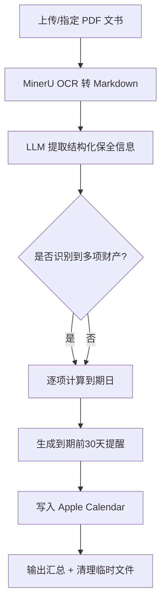
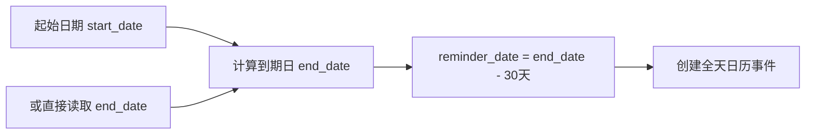
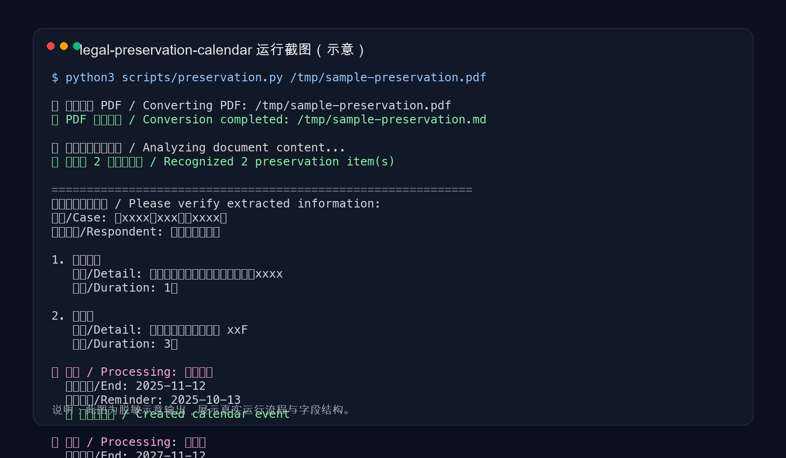
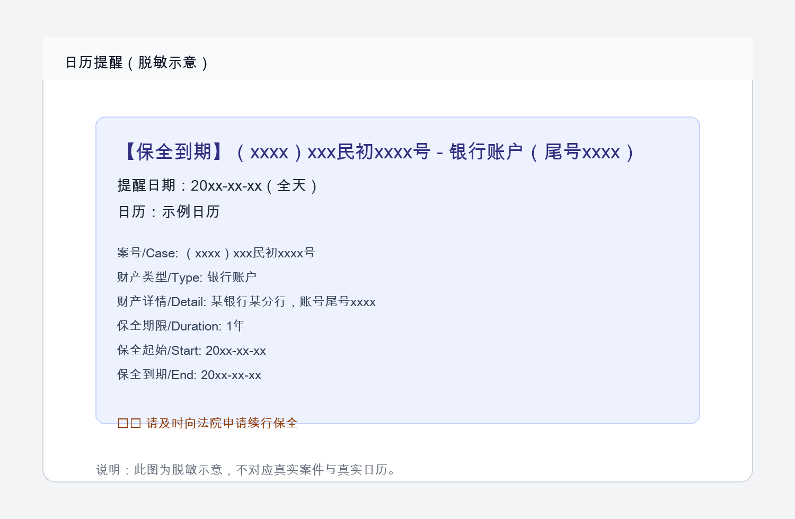

# 🛡️ Legal Preservation Calendar

<p align="center">
  <strong>财产保全到期提醒工具</strong><br>
  自动识别法院保全文书 · 提取关键信息 · 到期前 30 天自动写入日历
</p>

<p align="center">
  
  
  
  
  
</p>

---

## ✨ 核心能力

| 能力 | 说明 |
|------|------|
| 📄 **PDF 文书识别** | 通过 MinerU OCR 将保全文书转为可解析文本 |
| 🧠 **智能信息提取** | 自动提取案号、当事人、财产类型、期限、起止日期 |
| 🏦 **多财产拆分提醒** | 银行账户 / 不动产 / 股权 / 车辆等分别创建独立提醒 |
| ⏰ **到期前 30 天提醒** | 自动计算提醒日期并写入 Apple Calendar |
| ✍️ **手写日期风险提示** | 检测手写日期或 OCR 识别风险并高亮警告 |
| 🧹 **自动清理临时文件** | 处理完成后清理工作文件，保持环境整洁 |

---

## 🚀 快速开始

### 环境要求

- macOS（需要 Apple Calendar）
- Python 3.8+
- 已安装并可用的 `mineru-ocr` Skill
- `anthropic` Python 包

### 安装

```bash
# 1. 克隆仓库
git clone https://github.com/xuezhihaoyun/legal-preservation-calendar.git
cd legal-preservation-calendar

# 2. 安装到 Claude Code Skills 目录
cp -r . ~/.claude/skills/legal-preservation-calendar

# 3. 安装依赖
python3 -m pip install anthropic
```

### 配置 MinerU Token

访问 [MinerU Token 管理页](https://mineru.net/apiManage/token) 创建 Token，并按 `mineru-ocr` Skill 说明完成配置。

---

## 🎯 使用方法

### 方式 A：Claude Code 直接触发（推荐）

上传 PDF 后说以下任意一句：

- `帮我创建保全提醒`
- `财产保全`
- `preservation reminder`

### 方式 B：命令行执行

```bash
python3 scripts/preservation.py /path/to/preservation-document.pdf
```

---

## 📋 支持文书类型

- ✅ 财产保全裁定书
- ✅ 保全结果告知书 / 通知书
- ✅ 协助执行通知书
- ✅ 财产保全情况告知书

---

## 🔧 工作流程



### 提醒逻辑



---

## 📅 日历事件格式

| 字段 | 示例 |
|------|------|
| **标题** | `【保全到期】（xxxx）xxx民初xxxx号 - 银行账户（尾号xxxx）` |
| **提醒日期** | 到期日前 30 天 |
| **事件类型** | 全天事件 |
| **日历** | `工作` |
| **备注** | 案号、财产详情、保全期限、到期日、续行提醒 |

---

## 🖼️ 截图预览

### 命令行运行（脱敏示意）



### 日历提醒（脱敏示意）



> 仓库内置脱敏示意图，可直接替换同路径文件为真实办案截图。

---

## 📊 常见期限速查

| 财产类型 | 常见保全期限 |
|----------|-------------|
| 银行账户 | 1 年 |
| 不动产 | 3 年 |
| 股权 / 股份 | 3 年 |
| 车辆 | 2 年 |

> 以具体裁定文书为准，速查表仅作辅助参考。

---

## 📂 项目结构

```
legal-preservation-calendar/
├── README.md              # 本文件
├── SKILL.md               # Skill 入口说明
├── claude.md              # Skill 执行规则与上下文
├── reference.md           # 详细识别规范
├── template.md            # 日历模板与示例
├── CHANGELOG.md           # 版本变更记录
├── LICENSE                # 许可证
└── scripts/
    └── preservation.py    # 主脚本
```

---

## ⚠️ 注意事项

- 文书中若存在**手写日期**，OCR 可能误识别，请务必人工复核。
- 若起始日期缺失，脚本会根据文书日期或默认值推算，请复核后再依赖提醒。
- 日历事件默认写入 `工作` 日历，若你本机无该日历，请先创建或修改脚本中的日历名。

---

## 🔒 隐私与安全

- 文书内容不会上传到第三方持久化存储（除你主动配置的服务外）
- 临时处理文件会在流程结束后清理
- 日历事件创建在本地 macOS 日历中完成

---

## 🤝 贡献

欢迎提交 Issue / PR。建议：

- 代码遵循 PEP 8
- 示例数据请脱敏（案号、姓名、账号等）
- 新增功能尽量附带最小可复现示例

---

## 📄 License

MIT License，详见 [LICENSE](./LICENSE)。
